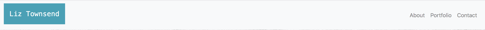
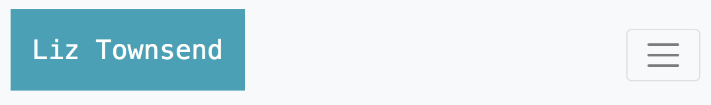

# responsive-portfolio

Creating a responsive portfolio using only Bootstrap css - no personal css.

Bootstrap is described as follows (from <a href="http://www.wikipedia.com">Wikipedia</a>)

```
Bootstrap is a free and open-source CSS framework directed at responsive, mobile-first front-end web development. It contains CSS- and (optionally) JavaScript-based design templates for typography, forms, buttons, navigation, and other interface components.

```
Utilizing Bootstrap allows one to easily create responsive website design.

For example, for the navigation bar, on smaller screens the links collapse into a hamburger icon:

Large screens show the full range of links:



Small screens show the hamburger icon:




The navbar was copied from Bootstrap, then modified. A background color and padding was added to the navbar header : `bg-info` and `p-3` to make the blue box around my name. `ml-auto` was used to justify the links to the right. The `search` box was removed.


